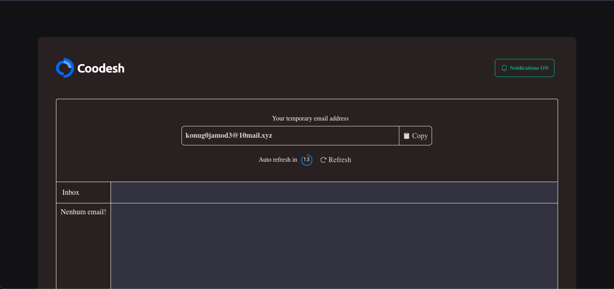
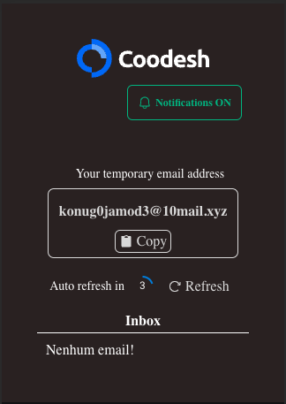

# DROPMAIL

<p align="center">
  
</p>

> The present project is a front-end web project developed with ReactJS and Vite.

## About

This project is a web application that allows users to send and receive temporary emails, without needing to register or password. The goal is to offer a simple and safe way to avoid spam, phishing and other types of online abuse. The project uses @apollo/client to communicate with an external GraphQL API that provides email data, and context API to manage the application state. The project also uses @mui/material to create elegant and responsive visual components, phosphor-react to add emoticons, styled-components to style components with CSS-in-JS, moment to format email dates, and react -copy-to-clipboard for easy copying of the email address generated by the application.

<p  align="center">
  
</p>

<p  align="center">
  
</p>

## ✨ Features

The project covers the following features:

- ✅ Generate a temporary email address
- ✅ Copy the generated email address
- ✅ View the inbox of this email
- ✅ Capture the arrival of new emails every 15 seconds.
- ✅ ON/OFF desktop notifications
- ✅ Save email access data to local storage
- ✅ Docker configuration.

## ⚙️ Environment

Copy the `.env.example` file, after, rename it to `.env`, and follow its instructions.

## ⚙️ Install and 🚀 Run App

> To install and use the project, you need to have [**Docker**](https://www.docker.com/get-started/) and [**Docker-compose**](https://docs.docker.com/compose/gettingstarted/) installed on your machine.

For the project installation, follow the steps:

Clone the project:

```

git clone https://github.com/RilsonO/dropmail
```

Go to project path in another terminal:

```
cd dropmail
```

Run the command:

```
docker-compose up
```

> After that, go to [**Cors demo**](https://cors-anywhere.herokuapp.com/corsdemo), and click on `Request temporary access to the demo server`. If you don't do this, the project won't work.

## 🤝 Collaborators

Thanks to the following people who contributed to this project:

<table>
  <tr>
    <td align="center">
      <a href="https://github.com/RilsonO">
        <br>
        <sub>
          <b>Rilson C Oliveira</b>
        </sub>
      </a>
    </td>
  </tr>
</table>
